
 
# PEN RUNNER

(working title)

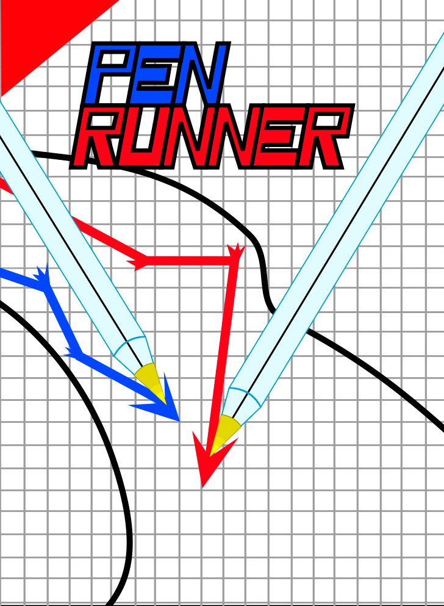

**Documento de diseño**

**Título:** Pen Runner (working title)

**Estudio/Diseñadores:** Bongo Cats

**Plataforma:** PC

**Versión:** 1.0

**Sinopsis de Jugabilidad y Contenido:**

Pen Runner es un juego de carreras multijugador competitivo. Es una interpretación de las carreras de chapas o carreras de bolis en una hoja de papel, juegos de un ambiente escolar. Todo esto cambiando las mecánicas ligeramente para adaptarlo a la plataforma.

**Categoría:**

Carreras. Recuerda a la idea de jugabilidad del Mario Kart, por los diferentes “power-ups” que se tienen pensado incluir; o incluso, por su mecánica, a un juego de golf por el control que se tiene del vehículo.

**Mecánica:**

El jugador controlará un vehículo determinando la dirección en la que se va a desplazar y la fuerza con la que va a ser lanzado. Cogiendo la dirección del ratón tenemos un arco cuya bisectriz siempre apunta al ratón, y dentro de dicho arco la flecha se desplazará rápidamente, fijando su dirección con el primer click del jugador. Después tendremos un medidor indicando la fuerza que irá subiendo y bajando y se quedará en el punto que marque el jugador con su segundo click. Todo esto simultáneamente funciona para todos los jugadores, de forma que tienen que apresurarse para hacer rápido sus lanzamientos y así ir por delante de sus rivales, pero con las prisas se arriesgan a hacer un mal lanzamiento, pues la dirección y la fuerza dependen de la velocidad de reacción del jugador. Los jugadores empezarán en una línea inicial y tendrán que entrar en la zona pasada la línea de meta para que se considere que han ganado. Además habrá distintos power ups y desventajas delimitados en zonas en las que si cae el jugador se le aplicarán sus efectos.

**Ejemplo de mecánica de movimiento:**

 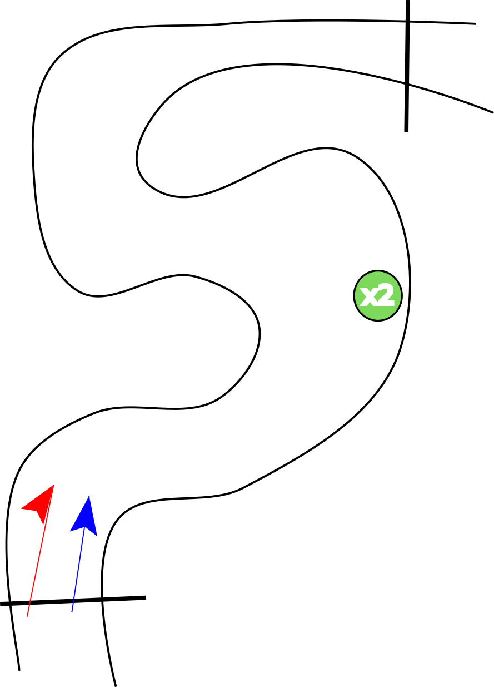

 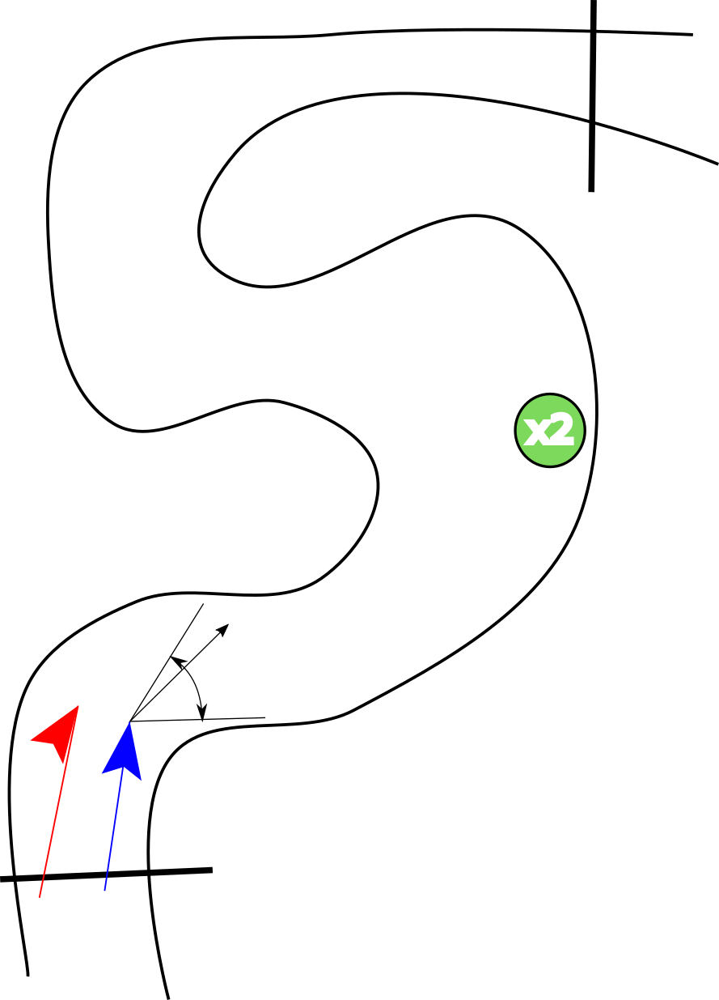

 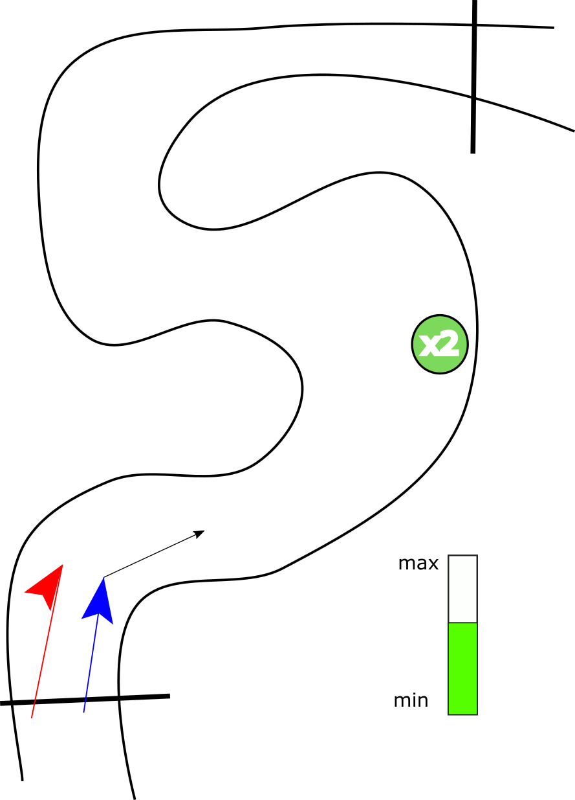

 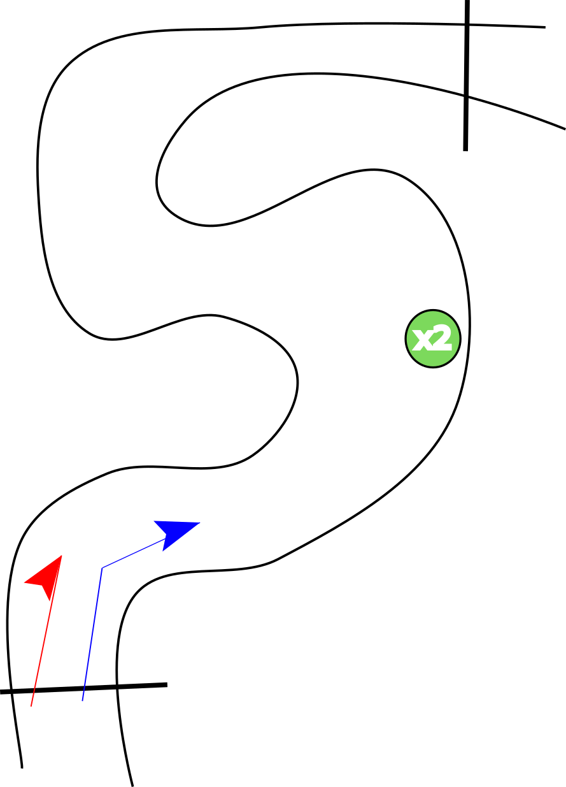

**Tecnología:**

Phaser 2.6.2, javascript, eclipse, photoshop, inkscape y adobe audition.

**Público:**

El juego va dirigido a todos los públicos, no tiene un perfil específico de jugador. Presenta un enfoque casual para sesiones de juego cortas entre varias personas, con una temática competitiva pero con un tono relajado.

**Historial de versiones:**

- Versión 0.0: Redacción del documento en primera instancia, explicando la visión general del mismo. Móstoles, 19 de Septiembre de 2018.

**Cámara:**

Cenital en 2D y tercera persona. Se utilizará únicamente el ratón.

**Controles:**

El juego se controla únicamente con el ratón. Se nos mostrará un arco y una flecha dentro de dicho arco que empieza en una posición aleatoria del arco y que gira rápidamente en dicho arco. El arco como tal se orientará en torno al ratón, apuntando en todo momento su bisectriz al cursor. Cuando el jugador de un click la posición de la flecha se fijará y entonces pasará a decidirse la potencia del tiro. Un medidor irá subiendo y bajando rápidamente y el tamaño de la flecha escalará acorde con el tamaño actual de dicho medidor. Con el siguiente click del jugador se decidirá la potencia y entonces el vehículo del jugador se desplazará acorde a la dirección y potencia elegidos.

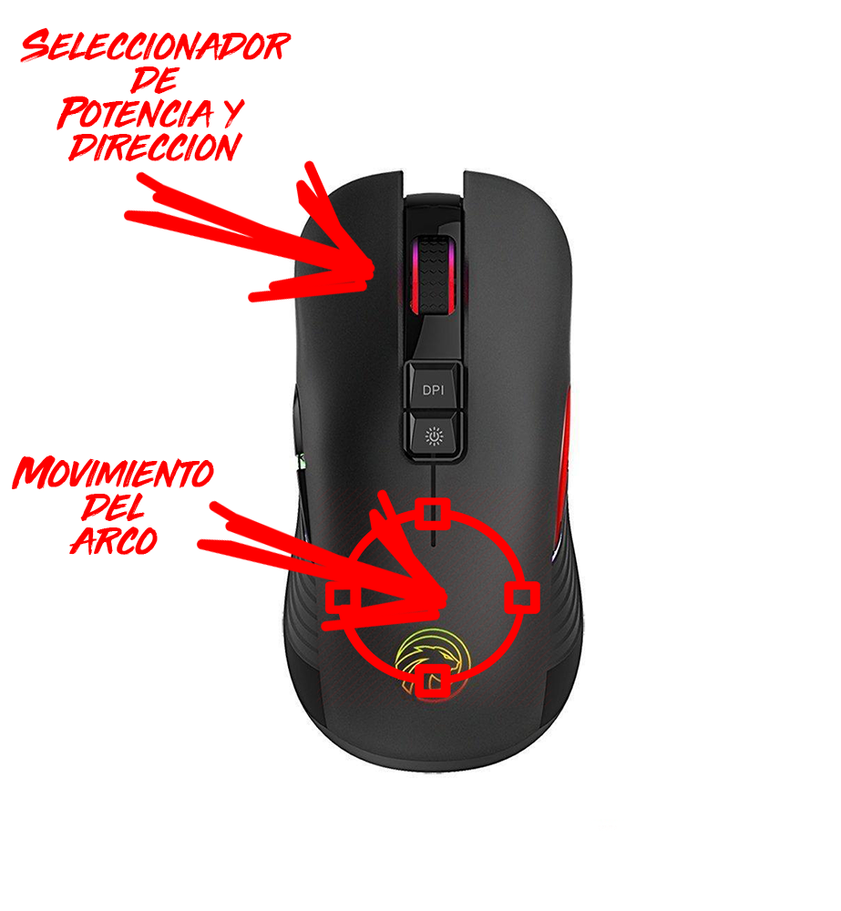

**Puntuación:**

Se darán puntos en base a la posición de llegada a la meta y el número de jugadores. De esta forma el primer jugador en llegar a la meta recibirá tantos puntos como jugadores haya, el siguiente uno menos y así hasta llegar al último. Este sistema de puntuación sólo se aplica si se juegan varias carreras sucesivas, para una sola carrera sólo es relevante la posición final del jugador.

**Guardar/Cargar:**

En este juego no es necesario implementar una función de guardado y cargado de partida, al menos no en la primera versión que se plantea del juego.

**Estados del juego:**

El juego tendrá las siguientes pantallas: Menú principal, pantalla de juego y menú de opciones, al que se puede acceder desde el menú principal y desde la pantalla del juego. Habrá un menú durante la partida que nos permitirá abandonar la partida pero no la pausará ya que se trata de un juego online:

	

El menú principal es invocado cuando iniciamos el juego, ya que no posee ninguna intro animada, con lo que saltaría directamente a esta pantalla. Desde este menú podemos invocar al menú de buscar partida, para empezar a jugar.

El menú de opciones puede ser invocado por dos pantallas diferentes. Podemos acceder mediante el menú principal, o mediante el menú de pausa dentro de una partida. En el primer caso, podemos invocar de nuevo al menú principal, pero si nos encontramos en el menú de ajustes de la partida, podremos invocar solo el menú de pausa de partida.

El menú de buscar partida es invocado por el menú principal, y es donde se buscan los jugadores para poder empezar una partida, algo así como una sala de espera. Puede invocar de nuevo al menú principal y a la pantalla de una partida.

Desde la pantalla de una partida, podemos invocar al menú de pausa propio de una partida que, aunque no pause el juego, nos dejará salir de vuelta al menú de jugar; o bien, acceder al menú de opciones, un tanto simplificado, para que sea más rápido de ejecutar. Cuando acabamos una partida, se invoca la pantalla de fin, donde se muestran las puntuaciones finales de todos los jugadores que han jugado a lo largo de todas las carreras y aún siguen ahí.

La pantalla de fin es invocada por la pantalla de una partida, y puede invocar a la pantalla del menú de jugar, para volver a buscar otra partida o salir al menú principal.

**Matchmaking:**

Dado que es un juego online losjugadores tendrán que ser capaces de encontrar partidas online de tal forma que el juego los empareje con otros jugadores. El algoritmo de matchmaking va a centrarse en dar la mejor experiencia posible, y por ello y dado que usaremos un sistema p2p el juego dará prioridad a las mejores conexiones, uniendo así a los jugadores con menor ping, siendo por tanto los más cercanos entre sí. El juego no tiene una gran curva de aprendizaje ni guarda resultados de las partidas así que no se considera necesario tener en cuenta el nivel de habilidad de los jugadores o su historial.

**Escenas:**

- **Menú principal:**

Nos permite acceder al juego, al menú de opciones y salir.

  
  

- **Menú opciones:**

Nos da la opción de configurar varios aspectos del juego, como el volumen del mismo.

 

- **Menú in-game:**

Se trata del menú que aparece cuando quieres pausar el juego. Al ser un juego multijugador competitivo, dicho menú no congelará el juego, sino que simplemente nos dará paso a poder acceder al menú de opciones y también la opción de salir de la partida, volviendo al menú principal.

- **Pantalla de juego:**

Esta será la pantalla principal del juego, se verá todo el desarrollo del juego. No poseerá ningún tipo de HUD más que los indicadores de dirección (el arco que indica la dirección a la que nos moveremos) y de potencia. A partir de esta pantalla sólo podremos acceder al menú pausa.

- **Pantalla de fin:**

En esta pantalla tenemos lo que aparecería cuando se acaba una partida, es decir, cuando acabamos todas las carreras, y salen las puntuaciones finales. A partir de esta pantalla, se podrá acceder de nuevo al menú de Jugar para buscar partida

- **Pantalla de buscar partida:**

Aquí se nos mostrará la pantalla mediante la cual buscaremos una partida, y nos mostrará una sala de chat donde se podrá hablar con los otros jugadores y votar por el siguiente mapa.

**Interfaces:**

Tenemos distintas interfaces en el juego. Para empezar, podemos hablar de HUD. Nuestro juego tiene un HUD bastante simple, que consiste en los medidores de potencia de un tiro cuando estamos jugando, mostrado en las imágenes anteriores como una barra de color verde que tiene un máximo y un mínimo.

	

También tenemos como interfaz los dos menús de opciones que tenemos en el juego, por un lado tenemos el menú que se accede desde el menú principal, y luego tenemos un menú de opciones, al cual se puede acceder dentro del juego, a través del menú de pausa.

En el nivel de tutorial, cuando se juega por primera vez el juego, también tendría una interfaz propia, puesto que nos explicaría cómo se juega al juego, y, por lo tanto, usa distintas animaciones que forman parte de la interfaz.

**Niveles:**

Los distintos niveles que tendrá el juego, serán escenarios con diferentes temáticas y ambientaciones. En algunos casos, representarán escenarios cotidianos; y en otros, escenarios más abstractos. No obstante, siempre tendrá un estudio detrás, para que no resulte en escenarios demasiado confusos o desorientadores. Siempre se tendrá una visión explícita de donde se encuentra el camino a seguir.

Si es la primera vez que se juega al juego, antes de poder jugar en modo competitivo se incluirá un pequeño tutorial para enseñar al jugador las mecánicas de juego. En este tutorial se explicará cómo funcionan los potenciadores de dirección y de fuerza, así como las funciones de los distintos &quot;power-ups&quot; que habrá. Este tutorial se ejecutará automáticamente al darle al botón de &quot;Jugar&quot;. Si no es la primera vez que se juega, el nivel o escenario donde se realizará la partida será sometido a votación por parte de los jugadores, o bien, será aleatorio.

Dentro del juego no existe un enemigo al uso, es decir, no existen NPCs hostiles. El enemigo sería el otro u otros jugadores que haya jugando contra ti.

Existen unos objetos, llamados &quot;power-ups&quot;, como ya se mencionó antes, que serán consumibles por cualquiera de los jugadores de la partida, y que tendrán distintas ventajas para el jugador que lo consuma.

Respecto a la música y los efectos de sonido, tanto el menú principal como la pantalla de juego tendrán una música de fondo. Todavía no está claro si la música utilizada será original del equipo, o bien se buscará libre de copyright.

**Progreso del Juego:**

El juego no tiene ningún progreso, hablando en un ámbito de juego de historia. El único progreso que se puede evaluar es la evolución de la puntuación de los jugadores a medida que van haciendo carreras. A continuación se muestra un gráfico con un ejemplo de cómo podría ser la progresión en nuestro juego.

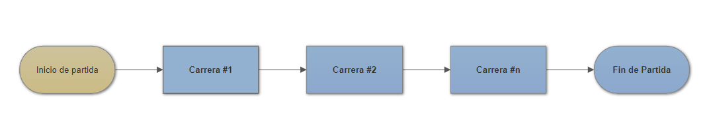

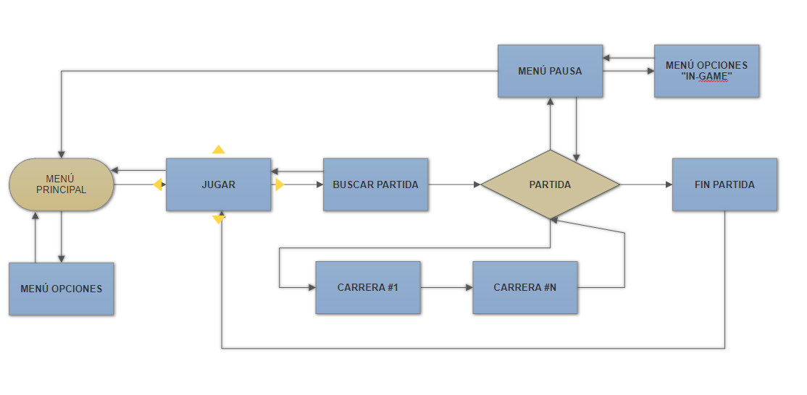

**Diagrama de escenas final:**

Este es el diagrama de escenas tal cual se encuentra estructurado en phaser.

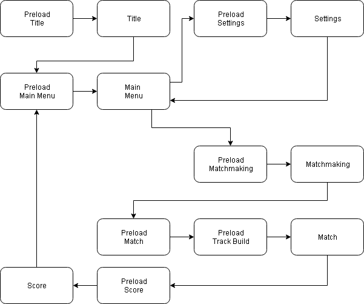

El primer esquema muestra la estructura de una partida; mientras que el segundo, muestra un diagrama del flujo de todo el juego, es decir, todas las pantallas que podemos visitar y desde donde podemos visitarlas.

**Escenas finales:**

<b>Title:</b> Esta escena simplemente muestra una animación con el título del juego y basta con hacer click para pasar a la siguiente escena.

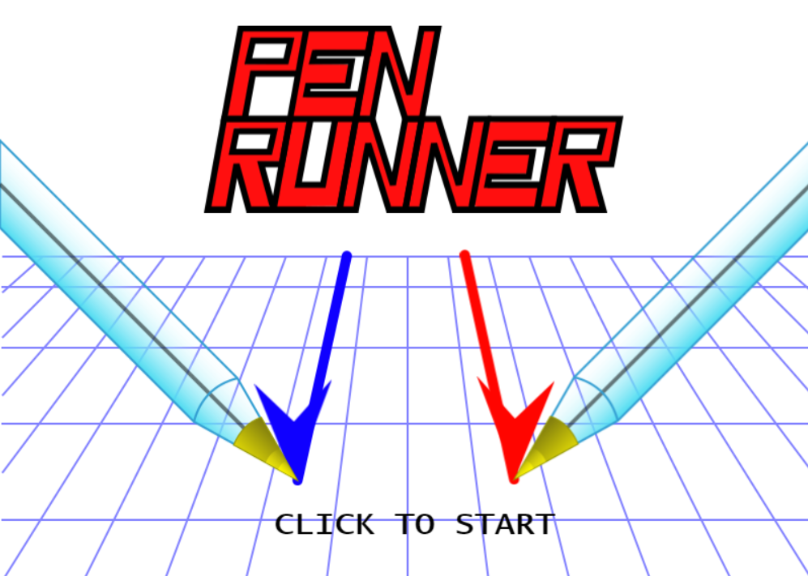

<b>Main Menu:</b> Esta escena presenta el menú principal con la opción de ir al menú de ajustes o simplemente jugar.

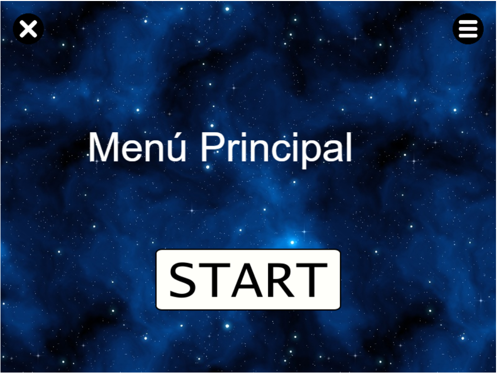

<b>Matchmaking:</b> Esta escena permite elegir qué circuito se quiere jugar y en un futuro será la escena donde se buscarán jugadores.

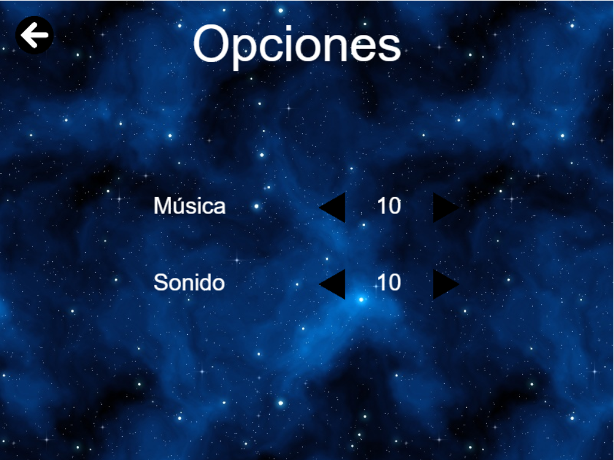

<b>Settings:</b> Esta escena permite ajustar el juego, cambiando el volumen del mismo, por ejemplo.

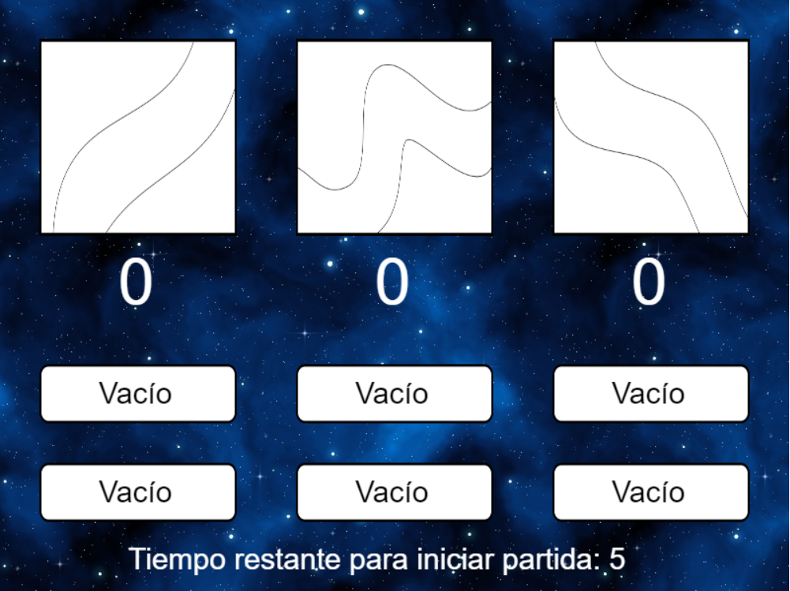

<b>Match:</b> Esta escena alberga el juego como tal. La escena carga un circuito, lo construye y luego podemos jugar en él.

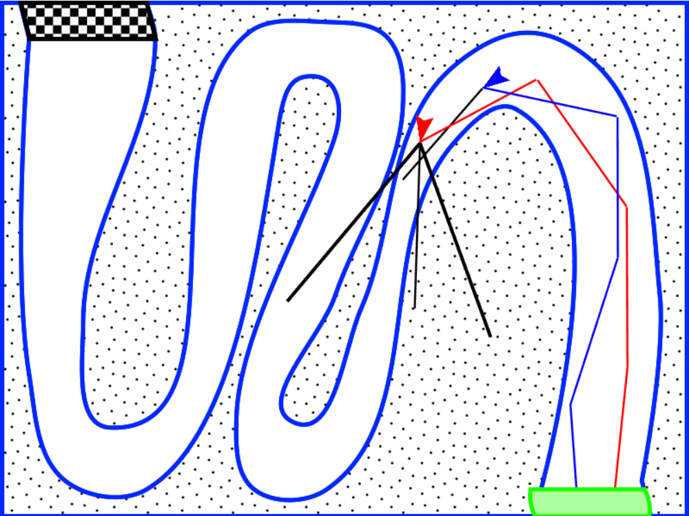

<b>Score:</b> Esta escena muestra las puntuaciones después de haber jugado una partida y permite volver a la pantalla de menu.

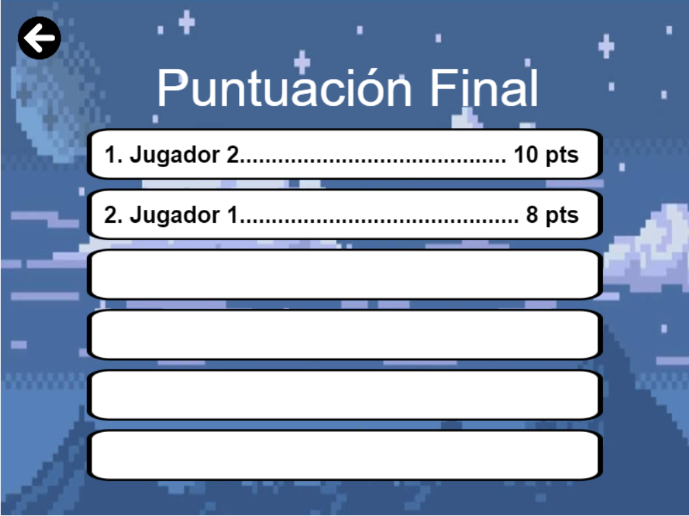

**Personajes y Enemigos:**

Al ser un juego multijugador competitivo, no hay unos personajes y/o enemigos bien diferenciados o definidos. Cuando tú te unes a una partida, cada jugador tendrá un personaje, elegido aleatoriamente; ese será el número total de personajes que habrá en la partida, que se representará con la imagen de algún tipo de vehículo.

Cuando hablamos de los enemigos, habría que mencionar que los enemigos son los demás jugadores que están en la partida. No hay enemigos NPCs, ni de ningún otro tipo.

Podría considerarse enemigo algún obstáculo animado que pudiese estar incluído en alguno de los mapas que se jugarán. Aún así, todavía no se ha decidido si esto último se incluirá.

**Items:**

Existen distintos ítems que se podrán encontrar a lo largo de los distintos escenarios durante las partidas:

- ❖❖ **Maxvel:** Consiste en un objeto de mejora que nos da la habilidad de llegar más lejos en la próxima tirada que hagamos.
- ❖❖ **Minvel:** Se trata de un objeto que nos penaliza disminuyendo la potencia máxima de la próxima tirada.
- ❖❖ **ExtrAcc:** Nos permite consumirlo en cualquier momento, y nos da la posibilidad de repetir una tirada de dirección.
- ❖❖ **Slower:** Si lo consumimos, en la próxima tirada, la flecha de dirección y de potencia irán un poco más lento.
- ❖❖ **Faster:** Si lo consumimos, en la próxima tirada, la flecha de dirección y de potencia irán un poco más rápido.

Además, el color del power up indica a quién va a afectar. Si es verde, afecta al jugador que lo coge, si es rojo, a su oponente; si es azul afecta a ambos y si es amarillo su efecto es aleatorio y puede afectar a cualquiera de los jugadores o a ambos.

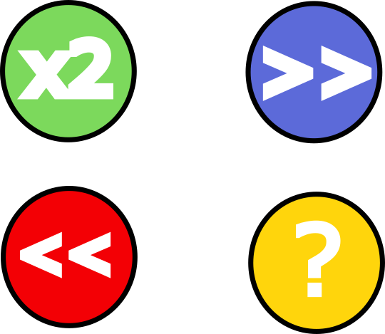

**Guión:**

Nuestro videojuego no posee diálogos extensos, puesto que no se trata de un juego que tenga una historia concreta. Los diálogos se reducirán a posibles expresiones que puedan hacer los personajes cuando ocurra algún evento dentro del juego; o cuando el propio juego necesite decirte algo, de manera escrita.

**Música:**

A estas alturas todavía no se sabe cuantos efectos de sonido meteremos en el juego, pero, a priori, podríamos decir:

- M\_001: Música de fondo en el menú principal y de opciones
- M\_002: Música cuando seleccionamos la dirección y la fuerza del disparo
- M\_003: Música de fondo durante los movimientos
- S\_001: Efecto de cuando cogemos un &quot;power-up&quot;
- S\_002: Efecto de salirnos del mapa y volver al punto anterior
- S\_003: Efecto de pulsar un botón o clickar sobre él.
- S\_004: Efecto de ganar
- S\_005: Efecto de perder
- S\_006: Efecto de acabar la carrera
- S\_007: Efecto de aceleración

**Miembros del equipo:**

- ➔➔César Romero Albertos
  - ◆◆Programador

- ➔➔Carlos Marques González
  - ◆◆Desarrollador

- ➔➔Juan Antonio Ruiz Ramírez
  - ◆◆Artista

**Detalles de producción:**

El proyecto se inició el día 19 de Septiembre de 2018 en Madrid, España. Se estima que tendrá una duración de, aproximadamente, 60 días, por lo que se acabará entre la primera y la segunda semana de noviembre.

El presupuesto del que disponemos para realizar este proyecto es de 0 (cero) euros. Este trabajo, en una primera instancia, es para uso académico, y no precisará de estudio para lanzarlo al mercado.

**       **
